# APM

> Application Performance Management 应用性能管理对一个应用的持续稳定运行至关重要。所以这篇文章就从一个 iOS App 的性能管理的纬度谈谈如何精确监控以及数据如何上报等技术点

App 的性能问题是影响用户体验的重要因素之一。性能问题主要包含：Crash、网络请求错误或者超时、UI 响应速度慢、主线程卡顿、CPU 和内存使用率高、耗电量大等等。大多数的问题原因在于开发者错误地使用了线程锁、系统函数、编程规范问题、数据结构等等。解决问题的关键在于尽早的发现和定位问题。

本篇文章着重总结了 APM 的原因以及如何收集数据。APM 数据收集后结合数据上报机制，按照一定策略上传数据到服务端。服务端消费这些信息并产出报告。请结合[姊妹篇](./1.80.md)， 总结了如何打造一款灵活可配置、功能强大的数据上报组件。


## 监控项目

- 页面渲染时长
- 主线程卡顿
- 网络错误+
- FPS
- 大文件存储
- CPU
- 内存使用
- Crash
- 启动时长


## 一、卡顿监控

卡顿问题，就是在主线程上无法响应用户交互的问题。影响着用户的直接体验，所以针对 App 的卡顿监控是 APM 里面重要的一环。

FPS（frame per second）每秒钟的帧刷新次数，iPhone 手机以 60 为最佳，iPad 某些型号是 120，也是作为卡顿监控的一项参考参数，为什么说是参考参数？因为它不准确。先说说怎么获取到 FPS。CADisplayLink 是一个系统定时器，会以帧刷新频率一样的速率来刷新视图。 `[CADisplayLink displayLinkWithTarget:self selector:@selector(###:)]`。至于为什么不准我们来看看下面的示例代码


```Objective-C
_displayLink = [CADisplayLink displayLinkWithTarget:self selector:@selector(p_displayLinkTick:)];
[_displayLink setPaused:YES];
[_displayLink addToRunLoop:[NSRunLoop currentRunLoop] forMode:NSRunLoopCommonModes];
```

代码所示，CADisplayLink 对象是被添加到指定的 RunLoop 的某个 Mode 下。所以还是 CPU 层面的操作。请继续往下看


#### 1. 屏幕绘制原理

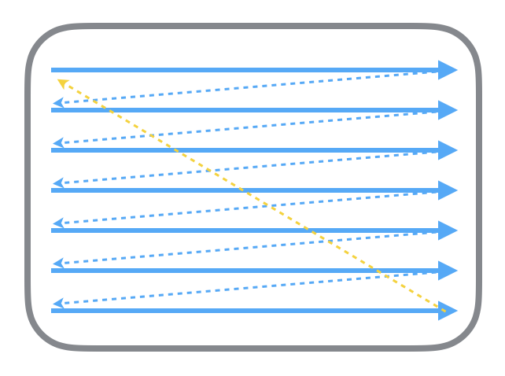

讲讲老式的 CRT 显示器的原理。 CRT 电子枪按照上面方式，从上到下一行行扫描，扫面完成后显示器就呈现一帧画面，随后电子枪回到初始位置继续下一次扫描。为了把显示器的显示过程和系统的视频控制器进行同步，显示器（或者其他硬件）会用硬件时钟产生一系列的定时信号。当电子枪换到新的一行，准备进行扫描时，显示器会发出一个水平同步信号（horizonal synchronization），简称 HSync；当一帧画面绘制完成后，电子枪恢复到原位，准备画下一帧前，显示器会发出一个垂直同步信号（Vertical synchronization），简称 VSync。显示器通常以固定的频率进行刷新，这个固定的刷新频率就是 VSync 信号产生的频率。虽然现在的显示器基本都是液晶显示屏，但是原理保持不变。


通常，屏幕上一张画面的显示是由 CPU、GPU 和显示器是按照上图的方式协同工作的。CPU 根据工程师写的代码计算好需要现实的内容（比如视图创建、布局计算、图片解码、文本绘制等），然后把计算结果提交到 GPU，GPU 负责图层合成、纹理渲染，随后 GPU 将渲染结果提交到帧缓冲区。随后视频控制器会按照 VSync 信号逐行读取帧缓冲区的数据，经过数模转换传递给显示器显示。

在帧缓冲区只有一个的情况下，帧缓冲区的读取和刷新都存在效率问题，为了解决效率问题，显示系统会引入2个缓冲区，即双缓冲机制。在这种情况下，GPU 会预先渲染好一帧放入帧缓冲区，让视频控制器来读取，当下一帧渲染好后，GPU 直接把视频控制器的指针指向第二个缓冲区。提升了效率。

目前来看，双缓冲区提高了效率，但是带来了新的问题：当视频控制器还未读取完成时，即屏幕内容显示了部分，GPU 将新渲染好的一帧提交到另一个帧缓冲区并把视频控制器的指针指向新的帧缓冲区，视频控制器就会把新的一帧数据的下半段显示到屏幕上，造成画面撕裂的情况。

为了解决这个问题，GPU 通常有一个机制叫垂直同步信号（V-Sync），当开启垂直同步信号后，GPU 会等到视频控制器发送 V-Sync 信号后，才进行新的一帧的渲染和帧缓冲区的更新。这样的几个机制解决了画面撕裂的情况，也增加了画面流畅度。但需要更多的计算资源


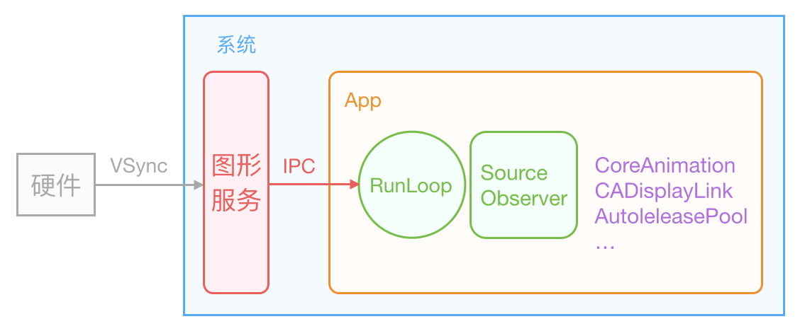

#### 答疑

可能有些人会看到「当开启垂直同步信号后，GPU 会等到视频控制器发送 V-Sync 信号后，才进行新的一帧的渲染和帧缓冲区的更新」这里会想，GPU 收到 V-Sync 才进行新的一帧渲染和帧缓冲区的更新，那是不是双缓冲区就失去意义了？

设想一个显示器显示第一帧图像和第二帧图像的过程。首先在双缓冲区的情况下，GPU 首先渲染好一帧图像存入到帧缓冲区，然后让视频控制器的指针直接直接这个缓冲区，显示第一帧图像。第一帧图像的内容显示完成后，视频控制器发送 V-Sync 信号，GPU 收到 V-Sync 信号后渲染第二帧图像并将视频控制器的指针指向第二个帧缓冲区。

**看上去第二帧图像是在等第一帧显示后的视频控制器发送 V-Sync 信号。是吗？真是这样的吗？ 😭 想啥呢，当然不是。 🐷 不然双缓冲区就没有存在的意义了**


揭秘。请看下图

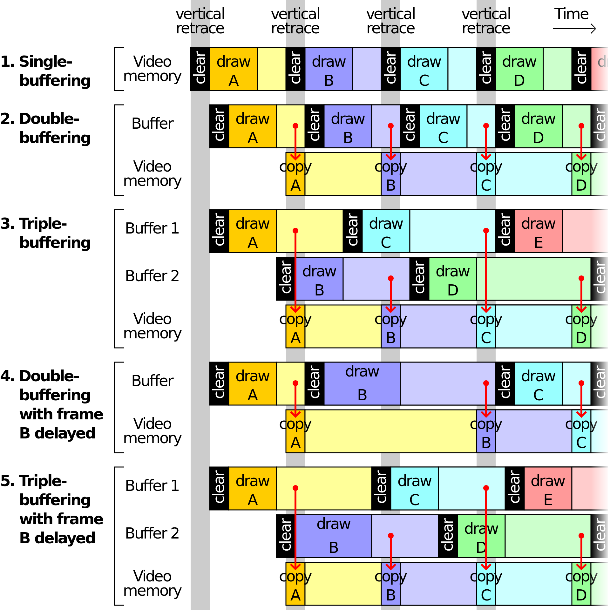


当第一次 V-Sync 信号到来时，先渲染好一帧图像放到帧缓冲区，但是不展示，当收到第二个 V-Sync 信号后读取第一次渲染好的结果（视频控制器的指针指向第一个帧缓冲区），并同时渲染新的一帧图像并将结果存入第二个帧缓冲区，等收到第三个 V-Sync 信号后，读取第二个帧缓冲区的内容（视频控制器的指针指向第二个帧缓冲区），并开始第三帧图像的渲染并送入第一个帧缓冲区，依次不断循环往复。

请查看资料，需要梯子：[Multiple buffering](https://en.m.wikipedia.org/wiki/Multiple_buffering)


#### 2. 卡顿产生的原因


VSync 信号到来后，系统图形服务会通过 CADisplayLink 等机制通知 App，App 主线程开始在 CPU 中计算显示内容（视图绘制、图形解码、文本绘制等）。然后将计算的内容提交到 GPU，GPU 经过图层的变换、合成、渲染，随后 GPU 把渲染结果提交到帧缓冲区，等待下一次 VSync 信号到来再显示之前渲染好的结果。在垂直同步机制的情况下，如果在一个 VSync 时间周期内，CPU 或者 GPU 没有完成内容的提交，就会造成该帧的丢弃，等待下一次机会再显示，这时候屏幕上还是之前渲染的图像，所以这就是 CPU、GPU 层面界面卡顿的原因。


目前 iOS 设备有双缓存机制，也有三缓冲机制，Android 现在主流是三缓冲机制，在早期是单缓冲机制。
[iOS 三缓冲机制例子](https://ios.developreference.com/article/12261072/Metal+newBufferWithBytes+usage)


CPU 和 GPU 资源消耗原因很多，比如对象的频繁创建、属性调整、文件读取、视图层级的调整、布局的计算（AutoLayout 视图个数多了就是线性方程求解难度变大）、图片解码（大图的读取优化）、图像绘制、文本渲染、数据库读取（多读还是多写乐观锁、悲观锁的场景）、锁的使用（举例：自旋锁使用不当会浪费 CPU）等方面。开发者根据自身经验寻找最优解（这里不是本文重点）。


#### 3. APM 如何监控卡顿并上报


CADisplayLink 肯定不用了，这个 FPS 仅作为参考。一般来讲，卡顿的监测有2种方案：**监听 RunLoop 状态回调、子线程 ping 主线程**


##### 3.1 RunLoop 状态监听的方式

RunLoop 负责监听输入源进行调度处理。比如网络、输入设备、周期性或者延迟事件、异步回调等。RunLoop 会接收2种类型的输入源：一种是来自另一个线程或者来自不同应用的异步消息（source0事件）、另一种是来自预定或者重复间隔的事件。

RunLoop 状态如下图


第一步：通知 Observers，RunLoop 要开始进入 loop，紧接着进入 loop
```Objective-c
if (currentMode->_observerMask & kCFRunLoopEntry )
    // 通知 Observers: RunLoop 即将进入 loop
    __CFRunLoopDoObservers(rl, currentMode, kCFRunLoopEntry);
// 进入loop
result = __CFRunLoopRun(rl, currentMode, seconds, returnAfterSourceHandled, previousMode);
```

第二步：开启 do while 循环保活线程，通知 Observers，RunLoop 触发 Timer 回调、Source0 回调，接着执行被加入的 block
```Objective-c
 if (rlm->_observerMask & kCFRunLoopBeforeTimers)
    //  通知 Observers: RunLoop 即将触发 Timer 回调
    __CFRunLoopDoObservers(rl, rlm, kCFRunLoopBeforeTimers);
if (rlm->_observerMask & kCFRunLoopBeforeSources)
    //  通知 Observers: RunLoop 即将触发 Source 回调
    __CFRunLoopDoObservers(rl, rlm, kCFRunLoopBeforeSources);
// 执行被加入的block
__CFRunLoopDoBlocks(rl, rlm);
```

第三步：RunLoop 在触发 Source0 回调后，如果 Source1 是 ready 状态，就会跳转到 handle_msg 去处理消息。
```Objective-c
//  如果有 Source1 (基于port) 处于 ready 状态，直接处理这个 Source1 然后跳转去处理消息
if (MACH_PORT_NULL != dispatchPort && !didDispatchPortLastTime) {
#if DEPLOYMENT_TARGET_MACOSX || DEPLOYMENT_TARGET_EMBEDDED || DEPLOYMENT_TARGET_EMBEDDED_MINI
    msg = (mach_msg_header_t *)msg_buffer;
    
    if (__CFRunLoopServiceMachPort(dispatchPort, &msg, sizeof(msg_buffer), &livePort, 0, &voucherState, NULL)) {
        goto handle_msg;
    }
#elif DEPLOYMENT_TARGET_WINDOWS
    if (__CFRunLoopWaitForMultipleObjects(NULL, &dispatchPort, 0, 0, &livePort, NULL)) {
        goto handle_msg;
    }
#endif
}
```

第四步：回调触发后，通知 Observers 即将进入休眠状态
```Objective-c
Boolean poll = sourceHandledThisLoop || (0ULL == timeout_context->termTSR);
// 通知 Observers: RunLoop 的线程即将进入休眠(sleep)
if (!poll && (rlm->_observerMask & kCFRunLoopBeforeWaiting)) __CFRunLoopDoObservers(rl, rlm, kCFRunLoopBeforeWaiting);
	__CFRunLoopSetSleeping(rl);
```

第五步：进入休眠后，会等待 mach_port 消息，以便再次唤醒。只有以下4种情况才可以被再次唤醒。
- 基于 port 的 source 事件
- Timer 时间到
- RunLoop 超时
- 被调用者唤醒
```Objective-c
do {
    if (kCFUseCollectableAllocator) {
        // objc_clear_stack(0);
        // <rdar://problem/16393959>
        memset(msg_buffer, 0, sizeof(msg_buffer));
    }
    msg = (mach_msg_header_t *)msg_buffer;
    
    __CFRunLoopServiceMachPort(waitSet, &msg, sizeof(msg_buffer), &livePort, poll ? 0 : TIMEOUT_INFINITY, &voucherState, &voucherCopy);
    
    if (modeQueuePort != MACH_PORT_NULL && livePort == modeQueuePort) {
        // Drain the internal queue. If one of the callout blocks sets the timerFired flag, break out and service the timer.
        while (_dispatch_runloop_root_queue_perform_4CF(rlm->_queue));
        if (rlm->_timerFired) {
            // Leave livePort as the queue port, and service timers below
            rlm->_timerFired = false;
            break;
        } else {
            if (msg && msg != (mach_msg_header_t *)msg_buffer) free(msg);
        }
    } else {
        // Go ahead and leave the inner loop.
        break;
    }
} while (1);
```

第六步：唤醒时通知 Observer，RunLoop 的线程刚刚被唤醒了
```Objective-C
// 通知 Observers: RunLoop 的线程刚刚被唤醒了
if (!poll && (rlm->_observerMask & kCFRunLoopAfterWaiting)) __CFRunLoopDoObservers(rl, rlm, kCFRunLoopAfterWaiting);
    // 处理消息
    handle_msg:;
    __CFRunLoopSetIgnoreWakeUps(rl);
```

第七步：RunLoop 唤醒后，处理唤醒时收到的消息
- 如果是 Timer 时间到，则触发 Timer 的回调
- 如果是 dispatch，则执行 block
- 如果是 source1 事件，则处理这个事件
```Objective-C
#if USE_MK_TIMER_TOO
        // 如果一个 Timer 到时间了，触发这个Timer的回调
        else if (rlm->_timerPort != MACH_PORT_NULL && livePort == rlm->_timerPort) {
            CFRUNLOOP_WAKEUP_FOR_TIMER();
            // On Windows, we have observed an issue where the timer port is set before the time which we requested it to be set. For example, we set the fire time to be TSR 167646765860, but it is actually observed firing at TSR 167646764145, which is 1715 ticks early. The result is that, when __CFRunLoopDoTimers checks to see if any of the run loop timers should be firing, it appears to be 'too early' for the next timer, and no timers are handled.
            // In this case, the timer port has been automatically reset (since it was returned from MsgWaitForMultipleObjectsEx), and if we do not re-arm it, then no timers will ever be serviced again unless something adjusts the timer list (e.g. adding or removing timers). The fix for the issue is to reset the timer here if CFRunLoopDoTimers did not handle a timer itself. 9308754
            if (!__CFRunLoopDoTimers(rl, rlm, mach_absolute_time())) {
                // Re-arm the next timer
                __CFArmNextTimerInMode(rlm, rl);
            }
        }
#endif
        //  如果有dispatch到main_queue的block，执行block
        else if (livePort == dispatchPort) {
            CFRUNLOOP_WAKEUP_FOR_DISPATCH();
            __CFRunLoopModeUnlock(rlm);
            __CFRunLoopUnlock(rl);
            _CFSetTSD(__CFTSDKeyIsInGCDMainQ, (void *)6, NULL);
#if DEPLOYMENT_TARGET_WINDOWS
            void *msg = 0;
#endif
            __CFRUNLOOP_IS_SERVICING_THE_MAIN_DISPATCH_QUEUE__(msg);
            _CFSetTSD(__CFTSDKeyIsInGCDMainQ, (void *)0, NULL);
            __CFRunLoopLock(rl);
            __CFRunLoopModeLock(rlm);
            sourceHandledThisLoop = true;
            didDispatchPortLastTime = true;
        }
        // 如果一个 Source1 (基于port) 发出事件了，处理这个事件
        else {
            CFRUNLOOP_WAKEUP_FOR_SOURCE();
            
            // If we received a voucher from this mach_msg, then put a copy of the new voucher into TSD. CFMachPortBoost will look in the TSD for the voucher. By using the value in the TSD we tie the CFMachPortBoost to this received mach_msg explicitly without a chance for anything in between the two pieces of code to set the voucher again.
            voucher_t previousVoucher = _CFSetTSD(__CFTSDKeyMachMessageHasVoucher, (void *)voucherCopy, os_release);

            CFRunLoopSourceRef rls = __CFRunLoopModeFindSourceForMachPort(rl, rlm, livePort);
            if (rls) {
#if DEPLOYMENT_TARGET_MACOSX || DEPLOYMENT_TARGET_EMBEDDED || DEPLOYMENT_TARGET_EMBEDDED_MINI
		mach_msg_header_t *reply = NULL;
		sourceHandledThisLoop = __CFRunLoopDoSource1(rl, rlm, rls, msg, msg->msgh_size, &reply) || sourceHandledThisLoop;
		if (NULL != reply) {
		    (void)mach_msg(reply, MACH_SEND_MSG, reply->msgh_size, 0, MACH_PORT_NULL, 0, MACH_PORT_NULL);
		    CFAllocatorDeallocate(kCFAllocatorSystemDefault, reply);
		}
#elif DEPLOYMENT_TARGET_WINDOWS
                sourceHandledThisLoop = __CFRunLoopDoSource1(rl, rlm, rls) || sourceHandledThisLoop;
#endif
```

第八步：根据当前 RunLoop 状态判断是否需要进入下一个 loop。当被外部强制停止或者 loop 超时，就不继续下一个 loop，否则进入下一个 loop
```Objective-C
if (sourceHandledThisLoop && stopAfterHandle) {
    // 进入loop时参数说处理完事件就返回
    retVal = kCFRunLoopRunHandledSource;
    } else if (timeout_context->termTSR < mach_absolute_time()) {
        // 超出传入参数标记的超时时间了
        retVal = kCFRunLoopRunTimedOut;
} else if (__CFRunLoopIsStopped(rl)) {
        __CFRunLoopUnsetStopped(rl);
    // 被外部调用者强制停止了
    retVal = kCFRunLoopRunStopped;
} else if (rlm->_stopped) {
    rlm->_stopped = false;
    retVal = kCFRunLoopRunStopped;
} else if (__CFRunLoopModeIsEmpty(rl, rlm, previousMode)) {
    // source/timer一个都没有
    retVal = kCFRunLoopRunFinished;
}
```

完整且带有注释的 RunLoop 代码见[此处](./../assets/CFRunLoop.c)。 Source1 是 RunLoop 用来处理 Mach port 传来的系统事件的，Source0 是用来处理用户事件的。收到 Source1 的系统事件后本质还是调用 Source0 事件的处理函数。


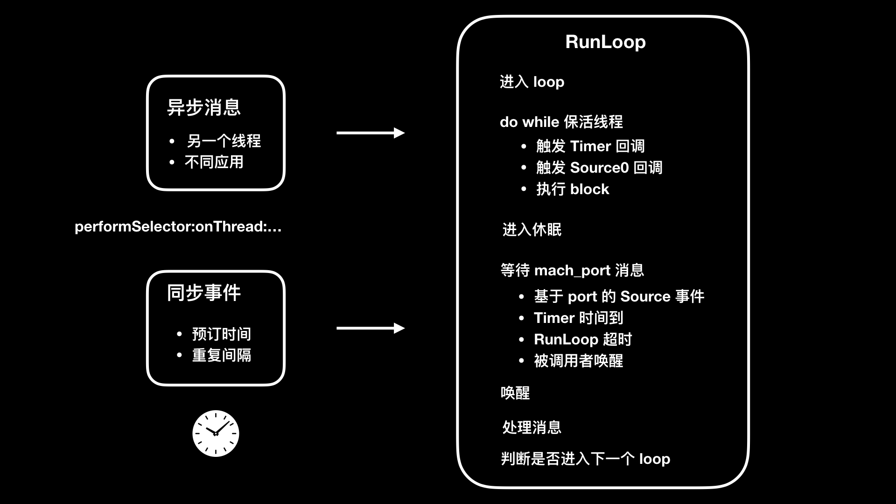
RunLoop 6个状态
```Objective-C

typedef CF_OPTIONS(CFOptionFlags, CFRunLoopActivity) {
    kCFRunLoopEntry ,           // 进入 loop
    kCFRunLoopBeforeTimers ,    // 触发 Timer 回调
    kCFRunLoopBeforeSources ,   // 触发 Source0 回调
    kCFRunLoopBeforeWaiting ,   // 等待 mach_port 消息
    kCFRunLoopAfterWaiting ),   // 接收 mach_port 消息
    kCFRunLoopExit ,            // 退出 loop
    kCFRunLoopAllActivities     // loop 所有状态改变
}
```

RunLoop 在进入睡眠前的方法执行时间过长而导致无法进入睡眠，或者线程唤醒后接收消息时间过长而无法进入下一步，都会阻塞线程。如果是主线程，则表现为卡顿。

一旦发现进入睡眠前的 KCFRunLoopBeforeSources 状态，或者唤醒后 KCFRunLoopAfterWaiting，在设置的时间阈值内没有变化，则可判断为卡顿，此时 dump 堆栈信息，还原案发现场，进而解决卡顿问题。


开启一个子线程，不断进行循环监测是否卡顿了。在 n 次都超过卡顿阈值后则认为卡顿了。卡顿之后进行堆栈 dump 并上报（具有一定的机制，数据处理在下一 part 讲）。

卡顿阈值的设置的依据是 WatchDog 的机制。APM 系统里面的阈值需要小于 WatchDog 的值，不需要非常小，一般认为启动时间在 5s，其他状态下都是 3s。WatchDog 在不同状态下具有不同的值。
- 启动（Launch）：20s
- 恢复（Resume）：10s
- 挂起（Suspend）：10s
- 退出（Quit）：6s
- 后台（Background）：3min（在 iOS7 之前可以申请 10min；之后改为 3min；可连续申请，最多到 10min）


```Objective-c
// 设置Runloop observer的运行环境
CFRunLoopObserverContext context = {0, (__bridge void *)self, NULL, NULL};
// 创建Runloop observer对象
_observer = CFRunLoopObserverCreate(kCFAllocatorDefault,
                                    kCFRunLoopAllActivities,
                                    YES,
                                    0,
                                    &runLoopObserverCallBack,
                                    &context);
// 将新建的observer加入到当前thread的runloop
CFRunLoopAddObserver(CFRunLoopGetMain(), _observer, kCFRunLoopCommonModes);
// 创建信号
_semaphore = dispatch_semaphore_create(0);

__weak __typeof(self) weakSelf = self;
// 在子线程监控时长
dispatch_async(dispatch_get_global_queue(0, 0), ^{
    __strong __typeof(weakSelf) strongSelf = weakSelf;
    if (!strongSelf) {
        return;
    }
    while (YES) {
        if (strongSelf.isCancel) {
            return;
        }
        // N次卡顿超过阈值T记录为一次卡顿
        long semaphoreWait = dispatch_semaphore_wait(self->_semaphore, dispatch_time(DISPATCH_TIME_NOW, strongSelf.limitMillisecond * NSEC_PER_MSEC));
        if (semaphoreWait != 0) {
            if (self->_activity == kCFRunLoopBeforeSources || self->_activity == kCFRunLoopAfterWaiting) {
                if (++strongSelf.countTime < strongSelf.standstillCount){
                    continue;
                }
                // 堆栈信息 dump 并结合数据上报机制，按照一定策略上传数据到服务器。堆栈 dump 会在下面讲解。数据上报会在 [打造功能强大、灵活可配置的数据上报组件](./1.80.md) 讲
            }
        }
        strongSelf.countTime = 0;
    }
});
```

可能很多人纳闷 RunLoop 状态那么多，为什么选择 KCFRunLoopBeforeSources 和 KCFRunLoopAfterWaiting？因为大部分卡顿都是在 KCFRunLoopBeforeSources 和 KCFRunLoopAfterWaiting 之间。比如 Source0 类型的 App 内部事件等

# todo：虽然知道 RunLoop 的状态，但是为什么是 dispatch_semaphore_wait


##### 3.2 子线程 ping 主线程监听的方式

开启一个子线程，创建一个初始值为0的信号量、一个初始值为 YES 的布尔值类型标志位。将设置标志位为 NO 的任务派发到主线程中去，子线程休眠阈值时间，时间到后判断标志位是否被主线程成功（值为 NO），如果没成功则认为猪线程发生了卡顿情况，此时 dump 堆栈信息并结合数据上报机制，按照一定策略上传数据到服务器。数据上报会在 [打造功能强大、灵活可配置的数据上报组件](./1.80.md) 讲

```Objective-c
while (self.isCancelled == NO) {
        @autoreleasepool {
            __block BOOL isMainThreadNoRespond = YES;
            
            dispatch_semaphore_t semaphore = dispatch_semaphore_create(0);
            
            dispatch_async(dispatch_get_main_queue(), ^{
                isMainThreadNoRespond = NO;
                dispatch_semaphore_signal(semaphore);
            });
            
            [NSThread sleepForTimeInterval:self.threshold];
            
            if (isMainThreadNoRespond) {
                if (self.handlerBlock) {
                    self.handlerBlock(); // 外部在 block 内部 dump 堆栈（下面会讲），数据上报
                }
            }
            
            dispatch_semaphore_wait(semaphore, DISPATCH_TIME_FOREVER);
        }
    }
```


#### 4. 堆栈 dump

方法堆栈的获取是一个麻烦事。理一下思路。`[NSThread callStackSymbols]` 可以获取当前线程的调用栈。但是当监控到卡顿发生，需要拿到主线程的堆栈信息就无能为力了。从任何线程回到主线程这条路走不通。先做个知识回顾。

在计算机科学中，调用堆栈是一种栈类型的数据结构，用于存储有关计算机程序的线程信息。这种栈也叫做执行堆栈、程序堆栈、控制堆栈、运行时堆栈、机器堆栈等。调用堆栈用于跟踪每个活动的子例程在完成执行后应该返回控制的点。

维基百科搜索到 “Call Stack” 的一张图和例子，如下
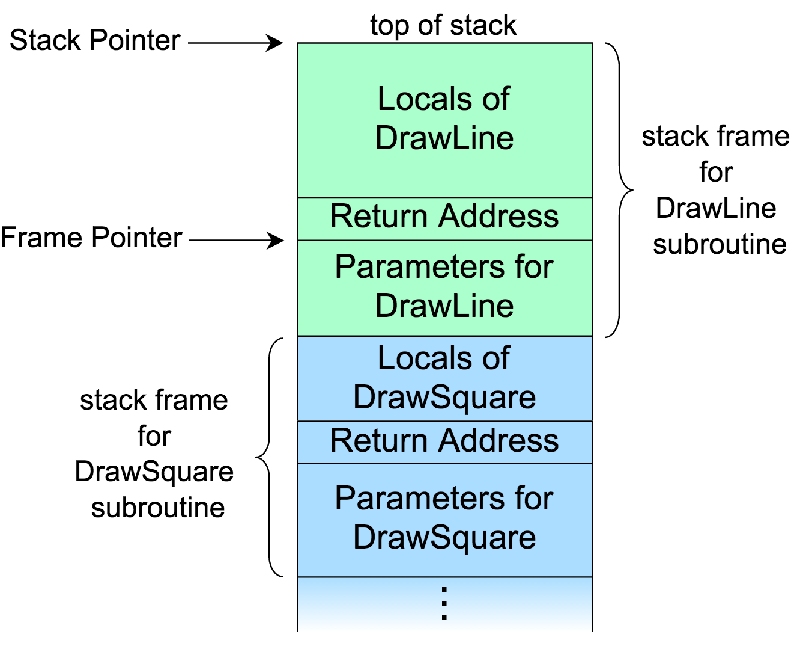
上图表示为一个栈。分为若干个栈帧（Frame），每个栈帧对应一个函数调用。下面蓝色部分表示 `DrawSquare` 函数，它在执行的过程中调用了 `DrawLine` 函数，用绿色部分表示。

可以看到栈帧由三部分组成：函数参数、返回地址、局部变量。比如在 DrawSquare 内部调用了 DrawLine 函数：第一先把 DrawLine 函数需要的参数入栈；第二把返回地址(控制信息。举例：函数 A 内调用函数 B，调用函数B 的下一行代码的地址就是返回地址)入栈；第三函数内部的局部变量也在该栈中存储。

栈指针 Stack Pointer 表示当前栈的顶部，大多部分操作系统都是栈向下生长，所以栈指针是最小值。帧指针 Frame Pointer 指向的地址中，存储了上一次 Stack Pointer 的值，也就是返回地址。

大多数操作系统中，每个栈帧还保存了上一个栈帧的帧指针。因此知道当前栈帧的 Stack Pointer 和 Frame Pointer 就可以不断回溯，递归获取栈底的帧。

接下来的步骤就是拿到所有线程的 Stack Pointer 和 Frame Pointer。然后不断回溯，还原案发现场。

App 在运行的时候，会对应一个 Mach Task，而 Task 下可能有多条线程同时执行任务。《OS X and iOS Kernel Programming》 中描述 Mach Task 为：任务（Task）是一种容器对象，虚拟内存空间和其他资源都是通过这个容器对象管理的，这些资源包括设备和其他句柄。

系统方法 `kern_return_t task_threads(task_inspect_t target_task, thread_act_array_t *act_list, mach_msg_type_number_t *act_listCnt);` 可以获取到所有的线程，不过这种方法获取到的线程信息是最底层的 **mach 线程**。

对于每个线程，可以用 `kern_return_t thread_get_state(thread_act_t target_act, thread_state_flavor_t flavor, thread_state_t old_state, mach_msg_type_number_t *old_stateCnt);` 方法获取它的所有信息，信息填充在 `_STRUCT_MCONTEXT` 类型的参数中，这个方法中有2个参数随着 CPU 架构不同而不同。所以需要定义宏屏蔽不同 CPU 之间的区别。

`_STRUCT_MCONTEXT` 结构体中，存储了当前线程的 Stack Pointer 和最顶部栈帧的 Frame pointer，进而回溯整个线程调用堆栈。

但是上述方法拿到的是内核线程，我们需要的信息是 NSThread，所以需要将内核线程转换为 NSThread。

pthread 的 p 是 **POSIX** 的缩写，表示「可移植操作系统接口」（Portable Operating System Interface）。设计初衷是每个系统都有自己独特的线程模型，且不同系统对于线程操作的 API 都不一样。所以 POSIX 的目的就是提供抽象的 pthread 以及相关 API。这些 API 在不同的操作系统中有不同的实现，但是完成的功能一致。

Unix 系统提供的 `task_threads` 和 `thread_get_state` 操作的都是内核系统，每个内核线程由 thread_t 类型的 id 唯一标识。pthread 的唯一标识是 pthread_t 类型。其中内核线程和 pthread 的转换（即 thread_t 和 pthread_t）很容易，因为 pthread 设计初衷就是「抽象内核线程」。

`pthread_create` 方法创建线程的回调函数为 **nsthreadLauncher**。
```Objective-c
static void *nsthreadLauncher(void* thread)  
{
    NSThread *t = (NSThread*)thread;
    [nc postNotificationName: NSThreadDidStartNotification object:t userInfo: nil];
    [t _setName: [t name]];
    [t main];
    [NSThread exit];
    return NULL;
}
```

NSThreadDidStartNotification 其实就是字符串 @"_NSThreadDidStartNotification"。

```Objective-c
<NSThread: 0x...>{number = 1, name = main}  
```
为了 NSThread 和内核线程对应起来，只能通过 name 一一对应。 pthread 的 API `pthread_getname_np` 也可获取内核线程名字。np 代表 not POSIX，所以不能跨平台使用。

思路概括为：将 NSThread 的原始名字存储起来，再将名字改为某个随机数（时间戳），然后遍历内核线程 pthread 的名字，名字匹配则 NSThread 和内核线程对应了起来。找到后将线程的名字还原成原本的名字。对于主线程，由于不能使用 `pthread_getname_np`，所以在当前代码的 load 方法中获取到 thread_t，然后匹配名字。


```Objective-c
static mach_port_t main_thread_id;  
+ (void)load {
    main_thread_id = mach_thread_self();
}
```


## 二、 App 启动时间监控

#### 1. App 启动时间的监控

思路比较简单。如下

- 在监控类的 `load` 方法中先拿到当前的时间值
- 监听 App 启动完成后的通知 `UIApplicationDidFinishLaunchingNotification`
- 收到通知后拿到当前的时间
- 步骤1和3的时间差就是 App 启动时间。

`mach_absolute_time` 是一个 CPU/总线依赖函数，返回一个基于系统启动后的时钟的“嘀嗒”数。系统休眠时不会增加。是一个纳秒级别的数字。获取前后2个纳秒后需要转换到秒。需要基于系统时间的基准，通过 `mach_timebase_info` 获得。

```Objective-c
mach_timebase_info_data_t g_cmmStartupMonitorTimebaseInfoData = 0;
mach_timebase_info(&g_cmmStartupMonitorTimebaseInfoData);
uint64_t timelapse = mach_absolute_time() - g_cmmLoadTime;
double timeSpan = (timelapse * g_cmmStartupMonitorTimebaseInfoData.numer) / (g_cmmStartupMonitorTimebaseInfoData.denom * 1e9);
```


#### 2. 线上监控启动时间就好，但是在开发阶段需要对启动时间做优化。

要优化启动时间，就先得知道在启动阶段到底做了什么事情，针对现状作出方案。 

pre-main 阶段定义为 App 开始启动到系统调用 main 函数这个阶段；main 阶段定义为 main 函数入口到主 UI 框架的 viewDidAppear。

App 启动过程：
- 解析 Info.plist：加载相关信息例如闪屏；沙盒建立、权限检查；
- Mach-O 加载：如果是胖二进制文件，寻找合适当前 CPU 架构的部分；加载所有依赖的 Mach-O 文件（递归调用 Mach-O 加载的方法）；定义内部、外部指针引用，例如字符串、函数等；加载分类中的方法；c++ 静态对象加载、调用 Objc 的 `+load()` 函数；执行声明为 __attribute_((constructor)) 的 c 函数；
- 程序执行：调用 main()；调用 UIApplicationMain()；调用 applicationWillFinishLaunching()；

Pre-Main 阶段
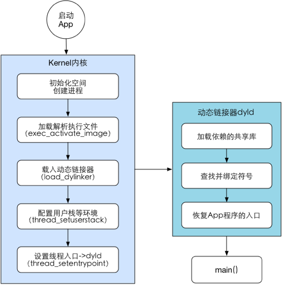

Main 阶段
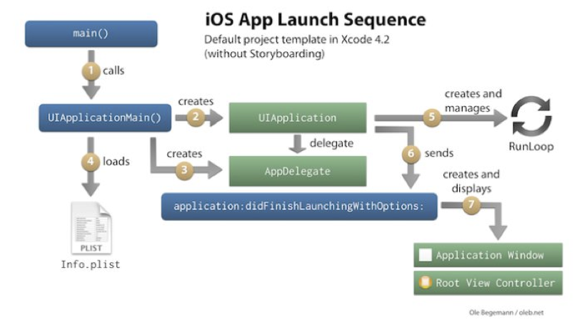


##### 2.1 加载 Dylib 

每个动态库的加载，dyld 需要
- 分析所依赖的动态库
- 找到动态库的 Mach-O 文件
- 打开文件
- 验证文件
- 在系统核心注册文件签名
- 对动态库的每一个 segment 调用 mmap（）

优化：
- 减少非系统库的依赖
- 使用静态库而不是动态库
- 合并非系统动态库为一个动态库

##### 2.2 Rebase && Binding

优化：
- 减少 Objc 类数量，减少 selector 数量，把未使用的类和函数都可以删掉
- 减少 c++ 虚函数数量
- 转而使用 Swift struct（本质就是减少符号的数量）


##### 2.3 Initializers

优化：
- 使用 `+initialize` 代替 `+load`
- 不要使用过 attribute*((constructor)) 将方法显示标记为初始化器，而是让初始化方法调用时才执行。比如使用 dispatch_one、pthread_once() 或 std::once()。也就是第一次使用时才初始化，推迟了一部分工作耗时也尽量不要使用 c++ 的静态对象


##### pre-main 阶段影响因素

- 动态库加载越多，启动越慢。
- ObjC 类越多，函数越多，启动越慢。
- 可执行文件越大启动越慢。
- C 的 constructor 函数越多，启动越慢。
- C++ 静态对象越多，启动越慢。
- ObjC 的 +load 越多，启动越慢。

优化手段：
- 减少依赖不必要的库，不管是动态库还是静态库；如果可以的话，把动态库改造成静态库；如果必须依赖动态库，则把多个非系统的动态库合并成一个动态库
- 检查下 framework应当设为optional和required，如果该framework在当前App支持的所有iOS系统版本都存在，那么就设为required，否则就设为optional，因为optional会有些额外的检查
- 合并或者删减一些OC类和函数。关于清理项目中没用到的类，使用工具AppCode代码检查功能，查到当前项目中没有用到的类（也可以用根据linkmap文件来分析，但是准确度不算很高）
有一个叫做[FUI](https://github.com/dblock/fui)的开源项目能很好的分析出不再使用的类，准确率非常高，唯一的问题是它处理不了动态库和静态库里提供的类，也处理不了C++的类模板
- 删减一些无用的静态变量
- 删减没有被调用到或者已经废弃的方法
- 将不必须在 +load 方法中做的事情延迟到 +initialize中，尽量不要用 C++ 虚函数(创建虚函数表有开销)
- 类和方法名不要太长：iOS每个类和方法名都在 __cstring 段里都存了相应的字符串值，所以类和方法名的长短也是对可执行文件大小是有影响的
因还是 Object-c 的动态特性，因为需要通过类/方法名反射找到这个类/方法进行调用，Object-c 对象模型会把类/方法名字符串都保存下来；
- 用 dispatch_once() 代替所有的 attribute((constructor)) 函数、C++ 静态对象初始化、ObjC 的 +load 函数；
- 在设计师可接受的范围内压缩图片的大小，会有意外收获。
压缩图片为什么能加快启动速度呢？因为启动的时候大大小小的图片加载个十来二十个是很正常的，
图片小了，IO操作量就小了，启动当然就会快了，比较靠谱的压缩算法是 TinyPNG。


##### main 阶段优化

- 减少启动初始化的流程。能懒加载就懒加载，能放后台初始化就放后台初始化，能延迟初始化的就延迟初始化，不要卡主线程的启动时间，已经下线的业务代码直接删除
- 优化代码逻辑。去除一些非必要的逻辑和代码，减小每个流程所消耗的时间
- 启动阶段使用多线程来进行初始化，把 CPU 性能发挥最大
- 使用纯代码而不是 xib 或者 storyboard 来描述 UI，尤其是主 UI 框架，比如 TabBarController。因为 xib 和 storyboard 还是需要解析成代码来渲染页面，多了一步。


## 三、 CPU 使用率监控

#### 1. CPU 架构

CPU（Central Processing Unit）中央处理器，市场上主流的架构有 ARM（arm64）、Intel（x86）、AMD 等。其中 Intel 使用 CISC（Complex Instruction Set Computer），ARM 使用 RISC（Reduced Instruction Set Computer）。区别在于**不同的 CPU 设计理念和方法**。

早期 CPU 全部是 CISC 架构，设计目的是**用最少的机器语言指令来完成所需的计算任务**。比如对于乘法运算，在 CISC 架构的 CPU 上。一条指令 `MUL ADDRA, ADDRB` 就可以将内存 ADDRA 和内存 ADDRB 中的数香乘，并将结果存储在 ADDRA 中。做的事情就是：将 ADDRA、ADDRB 中的数据读入到寄存器，相乘的结果写入到内存的操作依赖于 CPU 设计，所以** CISC 架构会增加 CPU 的复杂性和对 CPU 工艺的要求。**

RISC 架构要求软件来指定各个操作步骤。比如上面的乘法，指令实现为 `MOVE A, ADDRA; MOVE B, ADDRB; MUL A, B; STR ADDRA, A;`。这种架构可以降低 CPU 的复杂性以及允许在同样的工艺水平下生产出功能更加强大的 CPU，但是对于编译器的设计要求更高。

目前市场是大部分的 iPhone 都是基于 arm64 架构的。且 arm 架构能耗低。


#### 2. 获取线程信息

讲完了区别来讲下如何做 CPU 使用率的监控
- 开启定时器，按照设定的周期不断执行下面的逻辑
- 获取当前任务 task。从当前 task 中获取所有的线程信息（线程个数、线程数组）
- 遍历所有的线程信息，判断是否有线程的 CPU 使用率超过设置的阈值
- 假如有线程使用率超过阈值，则 dump 堆栈
- 组装数据，上报数据

线程信息结构体
```Objective-c
struct thread_basic_info {
	time_value_t    user_time;      /* user run time（用户运行时长） */
	time_value_t    system_time;    /* system run time（系统运行时长） */ 
	integer_t       cpu_usage;      /* scaled cpu usage percentage（CPU使用率，上限1000） */
	policy_t        policy;         /* scheduling policy in effect（有效调度策略） */
	integer_t       run_state;      /* run state (运行状态，见下) */
	integer_t       flags;          /* various flags (各种各样的标记) */
	integer_t       suspend_count;  /* suspend count for thread（线程挂起次数） */
	integer_t       sleep_time;     /* number of seconds that thread
	                                 *  has been sleeping（休眠时间） */
};
```

代码在讲堆栈还原的时候讲过，忘记的看一下上面的分析
```Objective-C
thread_act_array_t threads;
mach_msg_type_number_t threadCount = 0;
const task_t thisTask = mach_task_self();
kern_return_t kr = task_threads(thisTask, &threads, &threadCount);
if (kr != KERN_SUCCESS) {
    return ;
}
for (int i = 0; i < threadCount; i++) {
    thread_info_data_t threadInfo;
    thread_basic_info_t threadBaseInfo;
    mach_msg_type_number_t threadInfoCount;
    
    kern_return_t kr = thread_info((thread_inspect_t)threads[i], THREAD_BASIC_INFO, (thread_info_t)threadInfo, &threadInfoCount);
    
    if (kr == KERN_SUCCESS) {
        
        threadBaseInfo = (thread_basic_info_t)threadInfo;
        // todo：条件判断，看不明白
        if (!(threadBaseInfo->flags & TH_FLAGS_IDLE)) {
            integer_t cpuUsage = threadBaseInfo->cpu_usage / 10;
            if (cpuUsage > CPUMONITORRATE) {
                
                NSMutableDictionary *CPUMetaDictionary = [NSMutableDictionary dictionary];
                NSData *CPUPayloadData = [NSData data];
                
                NSString *backtraceOfAllThread = [BacktraceLogger backtraceOfAllThread];
                // 1. 组装卡顿的 Meta 信息
                CPUMetaDictionary[@"MONITOR_TYPE"] = CMMonitorCPUType;
            
                // 2. 组装卡顿的 Payload 信息（一个JSON对象，对象的 Key 为约定好的 STACK_TRACE， value 为 base64 后的堆栈信息）
                NSData *CPUData = [SAFE_STRING(backtraceOfAllThread) dataUsingEncoding:NSUTF8StringEncoding];
                NSString *CPUDataBase64String = [CPUData base64EncodedStringWithOptions:0];
                NSDictionary *CPUPayloadDictionary = @{@"STACK_TRACE": SAFE_STRING(CPUDataBase64String)};
                
                NSError *error;
                // NSJSONWritingOptions 参数一定要传0，因为服务端需要根据 \n 处理逻辑，传递 0 则生成的 json 串不带 \n
                NSData *parsedData = [NSJSONSerialization dataWithJSONObject:CPUPayloadDictionary options:0 error:&error];
                if (error) {
                    CMMLog(@"%@", error);
                    return;
                }
                CPUPayloadData = [parsedData copy];
                
                // 3. 数据上报会在 [打造功能强大、灵活可配置的数据上报组件](./1.80.md) 讲
                [[PrismClient sharedInstance] sendWithType:CMMonitorCPUType meta:CPUMetaDictionary payload:CPUPayloadData]; 
            }
        }
    }
}
```


## 四、App 占有内存

#### 1. 基础知识准备

硬盘：也叫做磁盘，用于存储数据。你存储的歌曲、图片、视频都是在硬盘里。

内存：由于硬盘读取速度较慢，如果 CPU 运行程序期间，所有的数据都直接从硬盘中读取，则非常影响效率。所以 CPU 会将程序运行所需要的数据从硬盘中读取到内存中。然后 CPU 与内存中的数据进行计算、交换。内存是易失性存储器（断电后，数据消失）。内存条区是计算机内部（在主板上）的一些存储器，用来保存 CPU 运算的中间数据和结果。内存是程序与 CPU 之间的桥梁。从硬盘读取出数据或者运行程序提供给 CPU。

**虚拟内存** 是计算机系统内存管理的一种技术。它使得程序认为它拥有连续的可用内存，而实际上，它通常被分割成多个物理内存碎片，可能部分暂时存储在外部磁盘（硬盘）存储器上（当需要使用时则用硬盘中数据交换到内存中）。Windows 系统中称为 “虚拟内存”，Linux/Unix 系统中称为 ”交换空间“。


#### 2. iOS 内存知识

内存（RAM）与 CPU 一样都是系统中最稀少的资源，也很容易发生竞争，应用内存与性能直接相关。iOS 没有交换空间作为备选资源，所以内存资源尤为重要。

什么是 OOM？是 out-of-memory 的缩写，字面意思是超过了内存限制。它是由 iOS 的 `Jetsam` 机制造成的一种非主流 Crash，它不能通过 Signal 这种监控方案所捕获。

什么是 Jetsam 机制？Jetsam 机制可以理解为系统为了控制内存资源过度使用而采用的一种管理机制。Jetsam 是一个独立的进程，每个进程都有一个内存阈值，一旦超过这个内存阈值，Jetsam 会立即杀掉这个进程。

为什么设计 Jetsam 机制？因为设备的内存是有限的，所以内存资源非常重要。系统进程以及其他使用的 App 都会抢占这个资源。由于 iOS 不支持交换空间，一旦触发低内存事件，Jetsam 就会尽可能多的释放 App 所在内存，这样 iOS 系统上出现内存不足时，App 就会被系统杀掉，变现为 crash。

iOS 不支持交换空间？不只是 iOS 不支持交换空间，大多数手机系统都不支持。因为移动设备的大量存储器是**闪存**，它的读写速度远远小电脑所使用的硬盘，也就是说手机即使使用了**交换空间**技术，也因为闪存慢的问题，不能提升性能，所以索性就没有交换空间技术。


内存过大的几种情况

- App 内存消耗较低，同时其他 App 内存管理也很棒，那么即使切换到其他 App，我们自己的 App 依旧是“活着”的，保留了用户状态。体验好
- App 内存消耗较低，但其他 App 内存消耗太大（可能是内存管理糟糕，也可能是本身就耗费资源，比如游戏），那么除了在前台的线程，其他 App 都会被系统杀死，回收内存资源，用来给活跃的进程提供内存。
- App 内存消耗较大，切换到其他 App 后，即使其他 App 向系统申请的内存不大，系统也会因为内存资源紧张，优先把内存消耗大的 App 杀死。表现为用户将 App 退出到后台，过会儿再次打开会发现 App 重新加载启动。
- App 内存消耗非常大，在前台运行时就被系统杀死，造成闪退。

App 内存不足时，系统会按照一定策略来腾出更多的空间供使用。比较常见的做法是将一部分优先级低的数据挪到磁盘上，该操作为称为 **page out**。之后再次访问这块数据的时候，系统会负责将它重新搬回到内存中，该操作被称为 **page in**。


##### 2.1 memory page

**Memory page** 是内存管理中的最小单位，是系统分配的，可能一个 page 持有多个对象，也可能一个大的对象跨越多个 page。通常它是 16KB 大小，且有3种类型的 page。

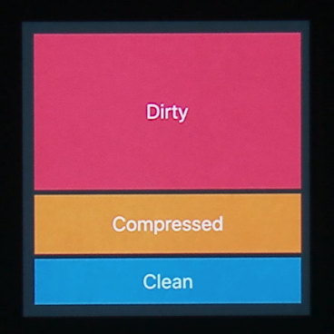


- Clean Memory
    Clean memory 包括3类：可以 `page out` 的内存、内存映射文件、App 使用到的 framework（每个 framework 都有 _DATA_CONST 段，通常都是 clean 状态，但使用 runtime swizling，那么变为 dirty）。

    一开始分配的 page 都是干净的（堆里面的对象分配除外），我们 App 数据写入时候变为 dirty。从硬盘读进内存的文件，也是只读的、clean page。

    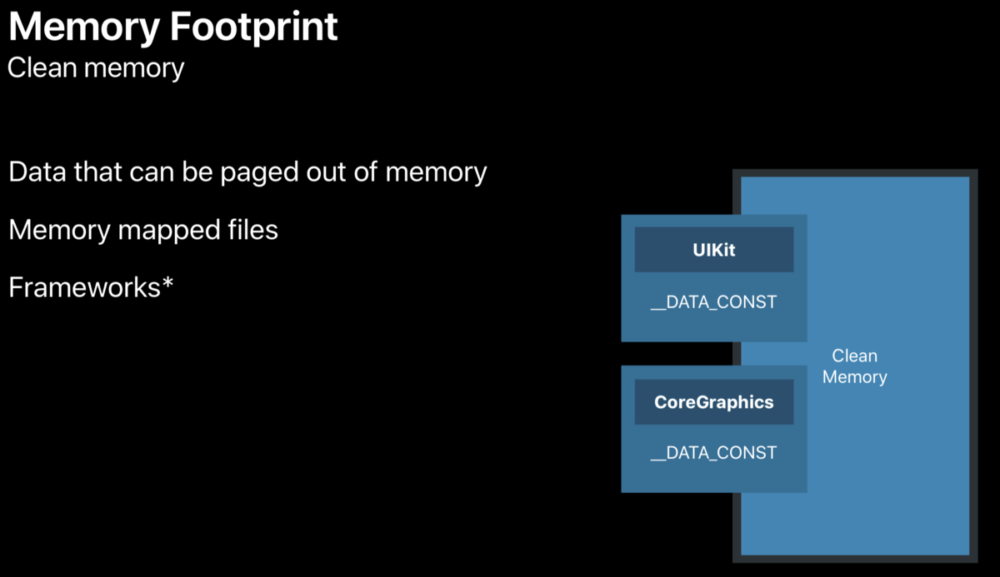

- Dirty Memory

    Dirty memory 包括4类：被 App 写入过数据的内存、所有堆区分配的对象、图像解码缓冲区、framework（framework 都有 _DATA 段和 _DATA_DIRTY 段，它们的内存都是 dirty）。

    在使用 framework 的过程中会产生 Dirty memory，使用单例或者全局初始化方法有助于帮助减少 Dirty memory（因为单例一旦创建就不销毁，一直在内存中，系统不认为是 Dirty memory）。

    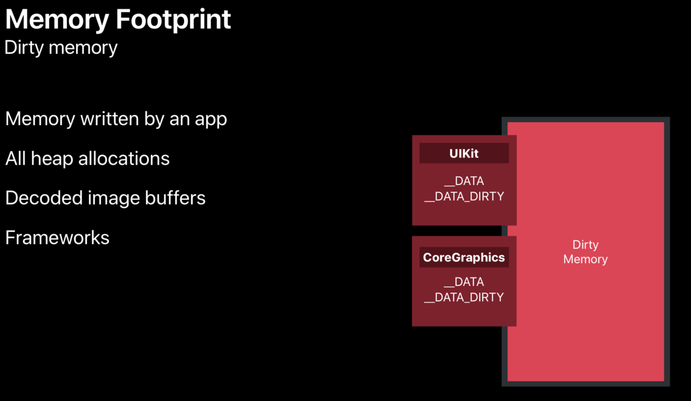

- Compressed Memory

    由于闪存容量和读写限制，iOS 没有交换空间机制，而是在 iOS7 引入了 **memory compressor**。它是在内存紧张时候能够将最近一段时间未使用过的内存对象，内存压缩器会把对象压缩，释放出更多的 page。在需要时内存压缩器对其解压复用。在节省内存的同时提高了响应速度。

App 运行内存 = pageNumbers * pageSize。因为 Compressed Memory 属于 Dirty memory。所以 Memory footprint = dirtySize + CompressedSize

设备不同，内存占用上限不同，App 上限较高，extension 上限较低，超过上限 crash 到 `EXC_RESOURCE_EXCEPTION`。
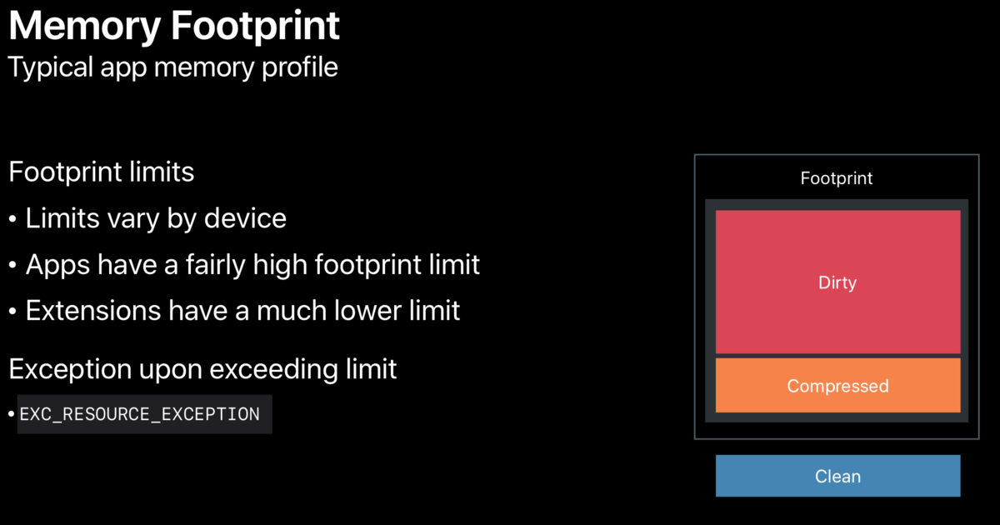


#### 2. 获取内存信息

// todo：APM 下 CPU 可以分析什么？什么场景？参数还是单独
App 内存信息的 API 可以在 Mach 层找到，`mach_task_basic_info` 结构体存储了 Mach task 的内存使用信息，其中 resident_size 就是应用使用的物理内存大小，virtual_size 是虚拟内存大小。

```Objective-c
#define MACH_TASK_BASIC_INFO     20         /* always 64-bit basic info */
struct mach_task_basic_info {
    mach_vm_size_t  virtual_size;       /* virtual memory size (bytes) */
    mach_vm_size_t  resident_size;      /* resident memory size (bytes) */
    mach_vm_size_t  resident_size_max;  /* maximum resident memory size (bytes) */
    time_value_t    user_time;          /* total user run time for
                                            terminated threads */
    time_value_t    system_time;        /* total system run time for
                                            terminated threads */
    policy_t        policy;             /* default policy for new threads */
    integer_t       suspend_count;      /* suspend count for task */
};
```
所以获取代码为
```Objective-c
task_vm_info_data_t vmInfo;
mach_msg_type_number_t count = TASK_VM_INFO_COUNT;
kern_return_t kr = task_info(mach_task_self(), TASK_VM_INFO, (task_info_t)&vmInfo, &count);

if (kr != KERN_SUCCESS) {
    return ;
}
CGFloat memoryUsed = (CGFloat)(vmInfo.phys_footprint/1024.0/1024.0);
```

可能有人好奇不应该是 `resident_size` 这个字段获取内存的使用情况吗？一开始测试后发现 resident_size 和 Xcode 测量结果差距较大。而使用 phys_footprint 则接近于 Xcode 给出的结果。且可以从 [WebKit 源码](https://github.com/WebKit/webkit/blob/52bc6f0a96a062cb0eb76e9a81497183dc87c268/Source/WTF/wtf/cocoa/MemoryFootprintCocoa.cpp)中得到印证。

基于近期的发现，可以在线下获取 App 的 high water mark，也就是 oom 内存阈值。 那么就产生了方案3

所以对于内存的监控思路就是找到系统给 App 的内存上限，然后当接近内存上限值的时候，dump 内存情况，组装基础数据信息成一个合格的上报数据，经过一定的数据上报策略到服务端，服务端消费数据，分析产生报表，客户端工程师根据报表分析问题。不同工程的数据以邮件、短信、企业微信等形式通知到该项目的 owner、开发者。（情况严重的会直接电话给开发者，并给主管跟进每一步的处理结果）。
问题分析处理后要么发布新版本，要么 hot fix。

监控内存增长，在达到  high water mark 附近的时候，dump 内存信息，获取对象名称、对象个数、各对象的内存值；如果稳定可以全量开启，不会有性能问题
OOMDetector 可以拿到分配内存的堆栈，对于定位到代码层面更加有效；可以灰度开放


## 五、 App 网络监控


## 参考资料

- [iOS 保持界面流畅的技巧](https://blog.ibireme.com/2015/11/12/smooth_user_interfaces_for_ios/)
- [Call Stack](https://en.wikipedia.org/wiki/Call_stack)
- [关于函数调用栈(call stack)的个人理解](https://blog.csdn.net/VarusK/article/details/83031643)
- [获取任意线程调用栈的那些事](https://bestswifter.com/callstack/)
- [iOS启动时间优化](https://www.zoomfeng.com/blog/launch-time.html)
- [WWDC2019之启动时间与Dyld3](https://www.zoomfeng.com/blog/launch-optimize-from-wwdc2019.html)

